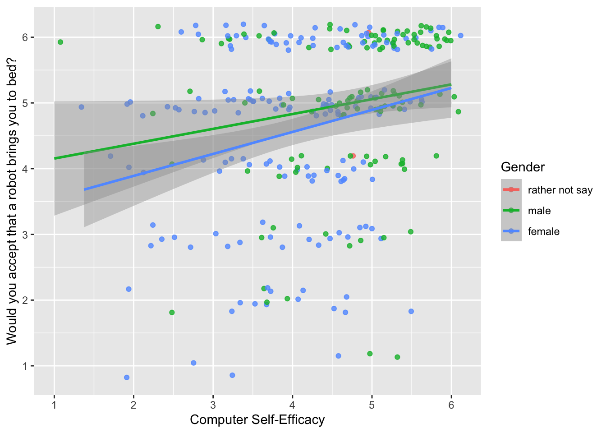

<!-- README.md is generated from README.Rmd. Please edit that file -->

# Dataforsocialscience

The goal of dataforsocialscience is to bundle a set of data sets that
are useful for teaching statistics in a social science field.

## Installation

You can install the current version of dataforsocialscience from github:

``` r
if(!require(devtools)){
  install.packages(devtools)
} 
devtools::install_github("statisticsforsocialscience/dataforsocialscience")
```

## Example data sets

These are the datasets contained in this package.

``` r
library(tidyverse)
library(dataforsocialscience)

robo_care %>% names()
#>  [1] "age"                 "gender"              "job_type"           
#>  [4] "robo_bed"            "robo_food"           "robo_med"           
#>  [7] "robo_body"           "robo_hair_wash"      "robo_mass"          
#> [10] "robo_bath"           "robo_wash"           "robo_toilett"       
#> [13] "robot_face"          "robo_hair_cut"       "human_bed"          
#> [16] "human_food"          "human_med"           "human_body"         
#> [19] "human_hair_wash"     "human_mass"          "human_bath"         
#> [22] "human_wash"          "human_toilett"       "human_face"         
#> [25] "human_hair_cut"      "human_care_pref"     "robot_care_pref"    
#> [28] "cse"                 "diff_pref"           "technical_knowledge"
#> [31] "privacy_concerns"    "automation_tendency" "care_experience"
robo_care %>% 
  ggplot() + 
  aes(cse, y = robo_bed, color = gender) + 
  geom_jitter(width = 0.2, height = 0.2, alpha = 0.8) +
  geom_smooth(method = "lm") +
  scale_x_continuous("Computer Self-Efficacy", breaks = 1:6) +
  scale_y_continuous("Would you accept that a robot brings you to bed?", breaks = 1:6) +
  labs(color = "Gender")
#> Warning: Removed 32 rows containing non-finite values (stat_smooth).
#> Warning: Removed 32 rows containing missing values (geom_point).
```


