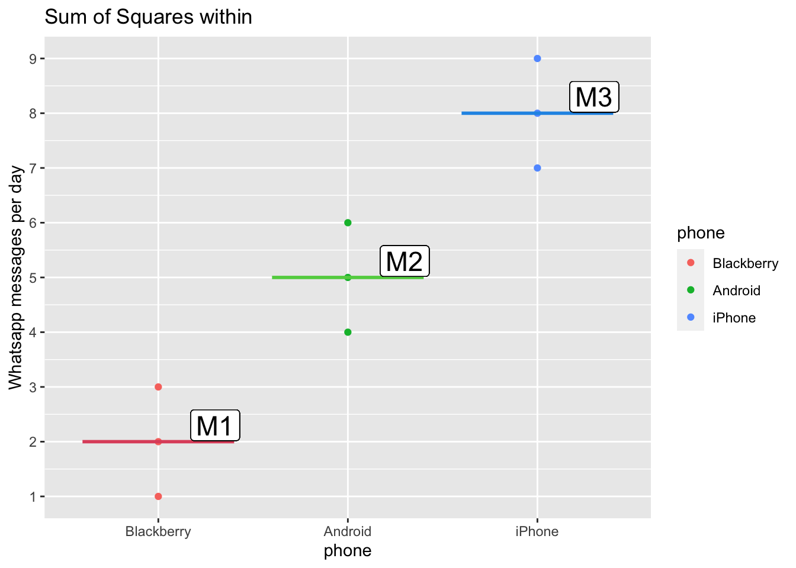
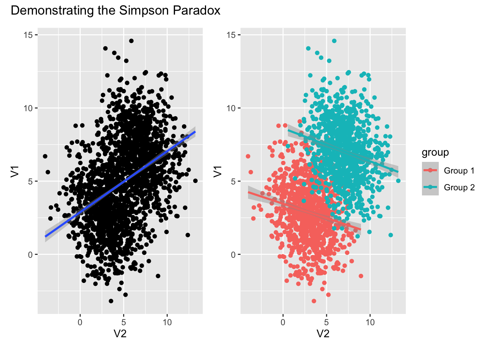

<!-- README.md is generated from README.Rmd. Please edit that file -->

# Dataforsocialscience

The goal of `dataforsocialscience` is to bundle a set of data sets that
are useful for teaching statistics in a social science field.

## Installation

You can install the current version of dataforsocialscience from github
as follows:

``` r
if(!require(remotes)){
  install.packages(remotes)
} 
remotes::install_github("statisticsforsocialscience/dataforsocialscience")
```

## Example data sets

These are the datasets contained in this package.

### Robot care

``` r
library(tidyverse)
library(dataforsocialscience)

robo_care %>% names()
#>  [1] "age"                 "gender"              "job_type"           
#>  [4] "robo_bed"            "robo_food"           "robo_med"           
#>  [7] "robo_body"           "robo_hair_wash"      "robo_mass"          
#> [10] "robo_bath"           "robo_wash"           "robo_toilet"        
#> [13] "robo_face"           "robo_hair_cut"       "human_bed"          
#> [16] "human_food"          "human_med"           "human_body"         
#> [19] "human_hair_wash"     "human_mass"          "human_bath"         
#> [22] "human_wash"          "human_toilet"        "human_face"         
#> [25] "human_hair_cut"      "care_pref_human"     "care_pref_robo"     
#> [28] "cse"                 "diff_pref"           "technical_knowledge"
#> [31] "privacy_concerns"    "automation_tendency" "care_experience"
robo_care %>% 
  ggplot() + 
  aes(cse, y = robo_bed, color = gender) + 
  geom_jitter(width = 0.2, height = 0.2, alpha = 0.8) +
  geom_smooth(method = "lm") +
  scale_x_continuous("Computer Self-Efficacy", breaks = 1:6) +
  scale_y_continuous("Would you accept that a robot brings you to bed?", breaks = 1:6) +
  labs(color = "Gender")
#> `geom_smooth()` using formula 'y ~ x'
```


### Phone usage

``` r
data("anova_phone")
ggplot(anova_phone) + 
  aes(phone, whatsapp, color = phone) +
  geom_point() +
  ggtitle("Sum of Squares within") +
  scale_y_continuous("Whatsapp messages per day", breaks = 1:10) +
  geom_line(data = data.frame(x = c(0.6,1.4), y = c(2.0,2.0)), aes(x,y), inherit.aes = FALSE, size = 1, color = 2) +
  geom_label(label = "M1", x = 1.3, y = 2.3, inherit.aes = FALSE, size = 6) +
  geom_line(data = data.frame(x = c(1.6,2.4), y = c(5.0,5.0)), aes(x, y), inherit.aes = FALSE, size = 1, color = 3) +
  geom_label(label = "M2", x = 2.3, y = 5.3, inherit.aes = FALSE, size = 6) +
  geom_line(data = data.frame(x = c(2.6,3.4), y = c(8.0,8.0)), aes(x,y), inherit.aes = FALSE, size = 1, color = 4) +
  geom_label(label = "M3", x = 3.3, y = 8.3, inherit.aes = FALSE, size = 6)
```



### Simpson Paradox

``` r
p1 <- simpson_paradox %>% 
  ggplot() + 
  aes(x = V2, y = V1, color = group) + 
  geom_point() + 
  geom_smooth(method = "lm")

p2 <- simpson_paradox %>% 
  ggplot() + 
  aes(x = V2, y = V1) + 
  geom_point() + 
  geom_smooth(method = "lm")

p2 + p1 + patchwork::plot_annotation(title = "Demonstrating the Simpson Paradox")
#> `geom_smooth()` using formula 'y ~ x'
#> `geom_smooth()` using formula 'y ~ x'
```


